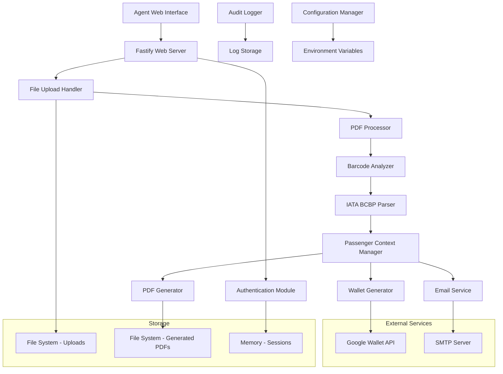

# Design Document

## Overview

The Boarding Pass Management System is a production-ready TypeScript application built with Fastify framework that processes real boarding pass PDFs, extracts IATA BCBP data from barcodes, generates Google Wallet passes, and delivers branded documents via email. The system follows a modular architecture with strict type safety and comprehensive security controls.

## Architecture

### High-Level Architecture



### Technology Stack

- **Runtime**: Node.js 20+
- **Language**: TypeScript with strict mode
- **Web Framework**: Fastify
- **PDF Processing**: pdfium-node or pdf2image
- **Barcode Detection**: zxing-cpp with OpenCV fallback
- **Authentication**: JWT with RS256
- **Email**: Nodemailer with SMTP
- **Google Wallet**: Official Google Wallet API
- **File Storage**: Local filesystem with unique identifiers

## Components and Interfaces

### 1. Authentication Module

```typescript
interface AuthenticationModule {
  login(credentials: LoginCredentials): Promise<AuthResult>
  validateToken(token: string): Promise<TokenValidation>
  logout(token: string): Promise<void>
  generateJWT(payload: JWTPayload): string
}

interface LoginCredentials {
  username: string
  password: string
}

interface AuthResult {
  success: boolean
  token?: string
  expiresAt?: Date
  role?: UserRole
}

interface TokenValidation {
  valid: boolean
  payload?: JWTPayload
  expired?: boolean
}

enum UserRole {
  AGENT = 'agent',
  ADMIN = 'admin'
}
```

### 2. PDF Processor

```typescript
interface PDFProcessor {
  processFile(filePath: string): Promise<ProcessingResult>
  convertToImages(pdfPath: string): Promise<string[]>
  validatePDF(filePath: string): Promise<ValidationResult>
}

interface ProcessingResult {
  success: boolean
  images?: string[]
  error?: string
  metadata: FileMetadata
}

interface FileMetadata {
  size: number
  pages: number
  format: string
  createdAt: Date
}
```

### 3. Barcode Analyzer

```typescript
interface BarcodeAnalyzer {
  detectBarcodes(imagePaths: string[]): Promise<BarcodeResult[]>
  analyzeBarcodeWithZxing(imagePath: string): Promise<BarcodeData | null>
  analyzeBarcodeWithOpenCV(imagePath: string): Promise<BarcodeData | null>
}

interface BarcodeResult {
  detected: boolean
  data?: string
  format?: BarcodeFormat
  confidence?: number
  method: 'zxing-cpp' | 'opencv'
}

interface BarcodeData {
  rawData: string
  format: BarcodeFormat
  boundingBox?: Rectangle
}

enum BarcodeFormat {
  AZTEC = 'aztec',
  PDF417 = 'pdf417',
  QR_CODE = 'qr_code',
  DATA_MATRIX = 'data_matrix'
}
```

### 4. IATA BCBP Parser

```typescript
interface IATABCBPParser {
  parse(barcodeData: string): Promise<BoardingPassData>
  validateBCBP(data: string): boolean
  extractMandatoryFields(data: string): MandatoryFields
  extractOptionalFields(data: string): OptionalFields
}

interface BoardingPassData {
  formatCode: string
  passengerName: string
  electronicTicketIndicator: string
  operatingCarrierPNR: string
  fromCityAirport: string
  toCityAirport: string
  operatingCarrierDesignator: string
  flightNumber: string
  dateOfFlight: string
  compartmentCode: string
  seatNumber: string
  checkInSequenceNumber: string
  passengerStatus: string
  fieldSize?: string
  beginningOfVersionNumber?: string
  versionNumber?: string
  fieldSizeOfFollowingStructuredMessage?: string
  passengerDescription?: string
  sourceOfCheckIn?: string
  sourceOfBoardingPassIssuance?: string
  dateOfIssueOfBoardingPass?: string
  documentType?: string
  airlineDesignatorOfBoardingPassIssuer?: string
  baggageTagLicensePlateNumber?: string
  firstNonConsecutiveBaggageTagLicensePlateNumber?: string
  secondNonConsecutiveBaggageTagLicensePlateNumber?: string
}

interface MandatoryFields {
  formatCode: string
  passengerName: string
  electronicTicketIndicator: string
  operatingCarrierPNR: string
  fromCityAirport: string
  toCityAirport: string
  operatingCarrierDesignator: string
  flightNumber: string
  dateOfFlight: string
  compartmentCode: string
  seatNumber: string
  checkInSequenceNumber: string
  passengerStatus: string
}
```

### 5. Passenger Context Manager

```typescript
interface PassengerContextManager {
  createContext(boardingPassData: BoardingPassData): PassengerContext
  updateContext(contextId: string, updates: Partial<PassengerContext>): Promise<void>
  getContext(contextId: string): Promise<PassengerContext | null>
  deleteContext(contextId: string): Promise<void>
}

interface PassengerContext {
  id: string
  boardingPassData: BoardingPassData
  uploadedFile: FileInfo
  processedAt: Date
  agentId: string
  status: ProcessingStatus
  walletPassUrl?: string
  brandedPdfPath?: string
  emailDelivery?: EmailDeliveryInfo
}

enum ProcessingStatus {
  UPLOADED = 'uploaded',
  PROCESSING = 'processing',
  PROCESSED = 'processed',
  WALLET_GENERATED = 'wallet_generated',
  PDF_GENERATED = 'pdf_generated',
  EMAIL_SENT = 'email_sent',
  COMPLETED = 'completed',
  FAILED = 'failed'
}
```

### 6. Wallet Generator

```typescript
interface WalletGenerator {
  generatePass(boardingPassData: BoardingPassData): Promise<WalletPassResult>
  createJWT(payload: GoogleWalletPayload): string
  validateCredentials(): Promise<boolean>
}

interface WalletPassResult {
  success: boolean
  passUrl?: string
  passId?: string
  error?: string
}

interface GoogleWalletPayload {
  iss: string
  aud: string
  typ: string
  iat: number
  exp: number
  payload: {
    flightObjects: FlightObject[]
    flightClasses: FlightClass[]
  }
}

interface FlightObject {
  id: string
  classId: string
  state: 'ACTIVE' | 'COMPLETED' | 'EXPIRED'
  passengerName: string
  reservationInfo: ReservationInfo
  boardingAndSeatingInfo: BoardingAndSeatingInfo
}
```

### 7. Email Service

```typescript
interface EmailService {
  sendBoardingPass(emailRequest: EmailRequest): Promise<EmailResult>
  validateEmailAddress(email: string): boolean
  configureTransport(config: SMTPConfig): void
  retryDelivery(emailId: string): Promise<EmailResult>
}

interface EmailRequest {
  to: string
  passengerName: string
  flightInfo: FlightInfo
  attachments: EmailAttachment[]
  walletPassUrl?: string
}

interface EmailResult {
  success: boolean
  messageId?: string
  error?: string
  retryCount: number
  deliveredAt?: Date
}

interface SMTPConfig {
  host: string
  port: number
  secure: boolean
  auth: {
    user: string
    pass: string
  }
}
```

### 8. Audit Logger

```typescript
interface AuditLogger {
  logAction(action: AuditAction): Promise<void>
  queryLogs(query: LogQuery): Promise<AuditLog[]>
  retainLogs(retentionDays: number): Promise<void>
}

interface AuditAction {
  agentId: string
  action: ActionType
  resourceId?: string
  metadata: Record<string, any>
  ipAddress: string
  userAgent: string
  timestamp: Date
}

enum ActionType {
  LOGIN = 'login',
  LOGOUT = 'logout',
  FILE_UPLOAD = 'file_upload',
  BARCODE_SCAN = 'barcode_scan',
  WALLET_GENERATION = 'wallet_generation',
  PDF_GENERATION = 'pdf_generation',
  EMAIL_SENT = 'email_sent',
  ERROR_OCCURRED = 'error_occurred'
}
```

## Data Models

### Core Data Structures

```typescript
interface FileInfo {
  id: string
  originalName: string
  storedPath: string
  size: number
  mimeType: string
  uploadedAt: Date
  uploadedBy: string
}

interface FlightInfo {
  flightNumber: string
  airline: string
  departure: AirportInfo
  arrival: AirportInfo
  date: string
  time: string
  gate?: string
  seat?: string
  class: string
}

interface AirportInfo {
  code: string
  name?: string
  city?: string
  terminal?: string
}

interface EmailAttachment {
  filename: string
  path: string
  contentType: string
}

interface Configuration {
  server: ServerConfig
  auth: AuthConfig
  googleWallet?: GoogleWalletConfig
  email?: EmailConfig
  storage: StorageConfig
  security: SecurityConfig
}

interface ServerConfig {
  port: number
  host: string
  environment: 'development' | 'production'
}

interface AuthConfig {
  jwtSecret: string
  jwtExpirationHours: number
  adminCredentials: {
    username: string
    password: string
  }
}

interface GoogleWalletConfig {
  serviceAccountEmail: string
  privateKey: string
  issuerId: string
}

interface EmailConfig {
  smtp: SMTPConfig
  from: string
  templates: {
    boardingPassSubject: string
    boardingPassTemplate: string
  }
}

interface StorageConfig {
  uploadsDirectory: string
  generatedPdfsDirectory: string
  maxFileSize: number
  allowedMimeTypes: string[]
}

interface SecurityConfig {
  rateLimiting: {
    windowMs: number
    maxRequests: number
  }
  cors: {
    origin: string[]
    credentials: boolean
  }
}
```

## Correctness Properties

*A property is a characteristic or behavior that should hold true across all valid executions of a system-essentially, a formal statement about what the system should do. Properties serve as the bridge between human-readable specifications and machine-verifiable correctness guarantees.*

### Property 1: Authentication Token Management
*For any* valid login credentials, the system should generate a JWT token with 8-hour expiration, and for any expired or logged-out token, the system should require re-authentication
**Validates: Requirements 1.1, 1.2, 1.3, 1.5**

### Property 2: Role-Based Access Control
*For any* authenticated user, the system should enforce access permissions based on their assigned role (agent or admin)
**Validates: Requirements 1.4**

### Property 3: File Upload Validation and Storage
*For any* uploaded file, the system should validate PDF format and size limits, store valid files with unique identifiers, and return appropriate confirmations or error messages
**Validates: Requirements 2.1, 2.2, 2.3, 2.4, 2.5**

### Property 4: Barcode Detection Pipeline
*For any* PDF file, the system should convert it to images, attempt barcode detection with zxing-cpp, fallback to OpenCV if needed, and return appropriate results or errors
**Validates: Requirements 3.1, 3.2, 3.3, 3.6**

### Property 5: IATA BCBP Parsing Completeness
*For any* valid IATA BCBP barcode, the system should extract all mandatory fields (passenger name, flight number, route, date, seat, gate) according to Resolution 792 standard
**Validates: Requirements 3.4, 3.5**

### Property 6: Google Wallet Pass Generation
*For any* valid boarding pass data, the system should create a Google Wallet pass using JWT RS256 authentication and return a secure add-to-wallet URL, or log errors and return user-friendly messages on failure
**Validates: Requirements 4.1, 4.2, 4.3, 4.5**

### Property 7: Branded PDF Generation Completeness
*For any* boarding pass data, the system should generate a minimalist PDF with anyway.ro branding, include all essential flight information, optimize for email delivery, and store with unique identifier
**Validates: Requirements 5.1, 5.2, 5.3, 5.4, 5.5**

### Property 8: Email Delivery with Attachments
*For any* email delivery request, the system should validate the recipient address, attach the branded PDF, include the Google Wallet link, use configured SMTP settings, and retry up to 3 times with exponential backoff on failure
**Validates: Requirements 6.1, 6.2, 6.3, 6.4, 6.5**

### Property 9: Comprehensive Audit Logging
*For any* system operation, the system should record the action with timestamp and agent ID, log file metadata for uploads, log email delivery details, retain logs for 90 days minimum, and provide searchable query results
**Validates: Requirements 7.1, 7.2, 7.3, 7.4, 7.5**

### Property 10: Rate Limiting and Security Validation
*For any* IP address, the system should enforce rate limiting of 100 requests per 15 minutes, return HTTP 429 with retry-after header when exceeded, validate all inputs to prevent injection attacks, and log security violations while blocking source IPs
**Validates: Requirements 8.1, 8.2, 8.3, 8.5**

### Property 11: Real Data Processing Only
*For any* data processing operation, the system should process only real PDF files and actual IATA BCBP barcodes, display "no data" messages when real data is unavailable, and never generate or use mock boarding pass data
**Validates: Requirements 9.1, 9.2, 9.3, 9.4**

### Property 12: Module Error Isolation
*For any* error occurring in a module, the system should isolate the failure to prevent system-wide crashes and continue operating other modules
**Validates: Requirements 10.4**

### Property 13: Health Check Availability
*For any* major module, the system should provide a health check endpoint that returns the correct operational status
**Validates: Requirements 10.5**

### Property 14: Typed Error Handling
*For any* error condition, the system should use proper error handling with typed exceptions that provide meaningful error information
**Validates: Requirements 11.5**

### Property 15: Configuration Management
*For any* system startup, the system should load configuration from environment variables, validate all required settings, enable features conditionally based on provided credentials (Google Wallet, SMTP), and fail to start with descriptive error messages when configuration is invalid
**Validates: Requirements 12.1, 12.2, 12.3, 12.4, 12.5**

## Error Handling

### Error Categories

1. **Authentication Errors**
   - Invalid credentials
   - Expired tokens
   - Insufficient permissions
   - Rate limit exceeded

2. **File Processing Errors**
   - Invalid file format
   - File size exceeded
   - Corrupted PDF
   - No barcode detected
   - Invalid IATA BCBP format

3. **External Service Errors**
   - Google Wallet API failures
   - SMTP server unavailable
   - Network timeouts
   - API rate limits

4. **System Errors**
   - Configuration missing
   - Storage failures
   - Memory exhaustion
   - Module crashes

### Error Response Format

```typescript
interface ErrorResponse {
  success: false
  error: {
    code: string
    message: string
    details?: Record<string, any>
    timestamp: string
    requestId: string
  }
}
```

### Error Handling Strategy

1. **Graceful Degradation**: System continues operating when non-critical components fail
2. **Retry Logic**: Automatic retries with exponential backoff for transient failures
3. **Circuit Breaker**: Prevent cascading failures by temporarily disabling failing services
4. **Comprehensive Logging**: All errors logged with context for debugging
5. **User-Friendly Messages**: Technical errors translated to user-understandable messages

## Testing Strategy

### Dual Testing Approach

The system requires both unit testing and property-based testing for comprehensive coverage:

**Unit Tests**: Verify specific examples, edge cases, and error conditions
- Authentication with valid/invalid credentials
- File upload with various file types and sizes
- IATA BCBP parsing with known boarding pass samples
- Email delivery with different SMTP configurations
- Error handling for specific failure scenarios

**Property Tests**: Verify universal properties across all inputs
- Authentication behavior across all possible credential combinations
- File validation across all possible file inputs
- Barcode detection across all possible image inputs
- Configuration validation across all possible environment variable combinations

### Property-Based Testing Configuration

- **Testing Library**: fast-check for TypeScript
- **Minimum Iterations**: 100 per property test
- **Test Tagging**: Each property test tagged with format: **Feature: boarding-pass-management-system, Property {number}: {property_text}**

### Test Coverage Requirements

1. **Authentication Module**: 95% code coverage
2. **PDF Processing Pipeline**: 90% code coverage
3. **Google Wallet Integration**: 85% code coverage (external API dependency)
4. **Email Service**: 90% code coverage
5. **Audit Logging**: 95% code coverage
6. **Configuration Management**: 100% code coverage

### Integration Testing

1. **End-to-End Workflows**: Complete boarding pass processing from upload to email delivery
2. **External Service Mocking**: Mock Google Wallet and SMTP services for reliable testing
3. **Error Injection**: Simulate failures at each stage of the pipeline
4. **Performance Testing**: Verify system handles expected load and file sizes
5. **Security Testing**: Validate input sanitization and authentication mechanisms